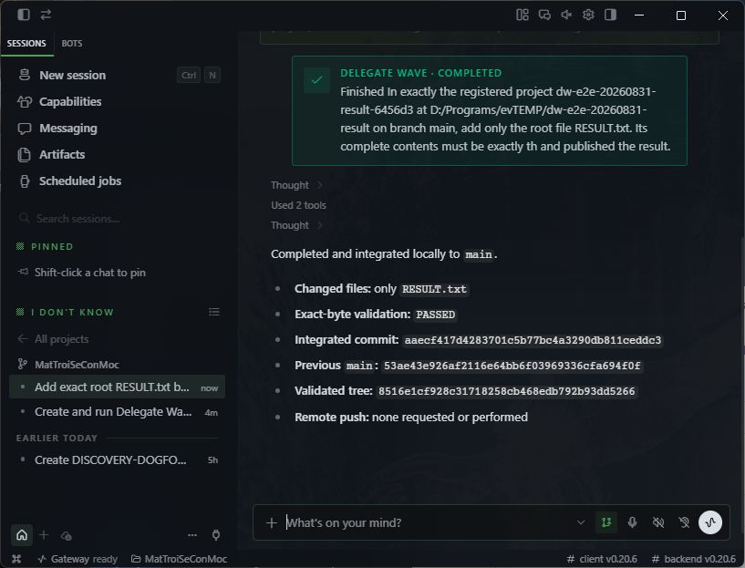
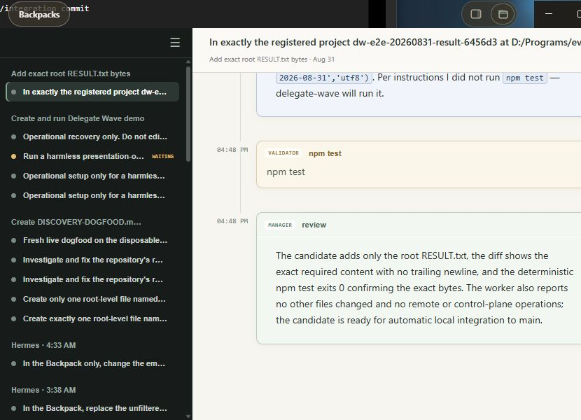

# Bounded physical dogfood — PASS

Run date: 2026-08-31. Runtime code: `3911c27d9641565c99ec13f0ebecf412c1cc3333`
(subsequent commits before the run were documentation only). This is one real
Desktop Hermes -> Delegate Wave -> local integration -> originating-conversation
wake test, not a simulated renderer run and not a phone test.

## Acceptance and identities

| Evidence | Value |
|---|---|
| Disposable repo | `D:/Programs/evTEMP/dw-e2e-20260831-result` |
| Registered project | `dw-e2e-20260831-result-6456d3` |
| Baseline | `53ae43e926af2116e64bb6f03969336cfa694f0f` |
| Hermes durable conversation | `20260831_164728_011bc5` |
| Hermes title | Add exact root RESULT.txt bytes |
| DW autonomous session | `asess_ba9e72f9-be56-4f90-9e79-71346b6753b8` |
| Root job | `job_5fa3c9a5-a3cc-494b-9924-22daa7b98562` |
| Only worker attempt | `job_5fa3c9a5-a3cc-494b-9924-22daa7b98562.1` |
| Manager run | `mrun_1b7e8929-f66b-4b4d-af11-f635f06a9b73` |
| Candidate and integrated commit | `aaecf417d4283701c5b77bc4a3290db811ceddc3` |
| Validated tree | `8516e1cf928c31718258cb468edb792b93dd5266` |
| Staged integration | `sint_9a3064f3-ebd6-47d8-a145-640e8063fc7f` |
| New wake / Hermes event ID | `wake_90d497a6-b503-4e0a-9bd4-94bf2bf526f4` |

All thirteen requested steps were exercised:

1. Operator created a new repository, with no RESULT.txt, and committed the validator.
2. Operator registered via `--validate "npm test"`; stored value is `["npm test"]`.
   The validator, package.json and README were protected. Baseline test failed
   with ENOENT, proving the result was not pre-created.
3. Used New session in the actual Hermes desktop and entered one bounded request.
4. Requested only RESULT.txt with literal `delegate-wave-dogfood-2026-08-31`,
   UTF-8, no newline/BOM. AUTO, maximum_cost 0.50, no remote push or external setup.
5. Hermes called session_start once; returned `watched: true`. It ended its turn
   saying it would wait. The persisted watch targets the exact originating ID.
6. Manager PLAN -> IMPLEMENT; one cheap worker, no exploration or revisions.
7. Only RESULT.txt changed. Dispatcher ran `npm test`, exit 0/PASSED.
8. Manager REVIEW -> ACCEPT.
9. Safe integration independently validated the prepared commit (exit 0), then
   published it to local main. Session COMPLETED, integration PUBLISHED.
10. A distinct COMPLETED wake was created for this exact Hermes conversation.
11. Hermes dashboard PID 25712 claimed and started that external turn.
12. Hermes automatically looked up the completed result once and replied with
    the exact integrated commit and validation, without an operator follow-up.
    External turn FINISHED/completed; DW wake DELIVERED/receiver FINISHED.
13. Papers displayed the settled worker, validator and final manager review;
    Hermes displayed the completed notification and verified result.

Independent post-integration `npm test` also passed; Git was clean, only
RESULT.txt differed from baseline, and the disposable repo has no remote.
The initial validator uses Buffer equality against the literal, not a guessed
length. Exact file size is 32 bytes.

## Time and external-turn transitions

Times below are UTC; local display is UTC+07:00.

| Milestone | Time |
|---|---|
| Initial UI submission | 09:47:28.171 |
| DW session created | 09:47:46.661 |
| Worker started | 09:48:00.464 |
| Worker attempt finished | 09:48:42.318 |
| Integration published | 09:48:49.241 |
| DW session completed | 09:48:49.244 |
| Wake created | 09:48:50.899 |
| Hermes event created | 09:48:59.632 |
| Hermes event claimed | 09:49:00.057 |
| Hermes event started | 09:49:00.066 |
| Automatic final reply persisted | 09:49:20.745 |
| Hermes event finished | 09:49:21.599 |
| DW verified delivery | 09:49:29.821 |

Submission to automatic reply: **112.574 seconds**. DW session creation to
completion: **62.583 seconds**. Worker attempt: **41.854 seconds**.

The read-only observer sampled STARTED and FINISHED. Creation and claim timing
come from durable receiver timestamps; the sub-second PENDING/claim transition
was not separately captured by its two-second sampling interval. We do not
claim to have observed an intermediate CLAIMED state. The event and wake share
one stable ID; receiver outcome is completed, error null, one delivery attempt.

## Usage and cost — separate accounting bases

| Component | Input | Output | Reasoning | Cache read | Recorded cost |
|---|---:|---:|---:|---:|---|
| Manager PLAN, gpt-5.6-luna | 26,378 | 394 | 137 | 0 | reference $0.0059128 |
| Manager REVIEW, gpt-5.6-luna | 1,797 | 76 | 177 | 26,310 | reference $0.0011892 |
| Worker, opencode-go/deepseek-v4-flash | 10,735 | 3,603 | 0 | 82,688 | executor-computed $0.005318496; reference $0.0027432664 |
| Originating Hermes conversation, gpt-5.6-sol | 6,934 | 742 | 99 | 105,472 | subscription_included; actual billed cost unknown |

Two manager turns, 55,269 total recorded tokens including cache and reasoning.
Manager reference total $0.007102 uses `opencode-go-2026-08-20` v1; it is not a
claim of Codex provider billing. Worker reference uses
`deepseek-direct-2026-08-14-v2`; executor-computed cost is also not a provider
invoice. These bases are deliberately not summed into a misleading total bill.
Worker receipt COMPLETE, eight provider steps, zero malformed events. Hermes
session accounting is the stored snapshot, not an independently audited bill.

## Interventions and limitations

- Operator provisioned/registered the repo and submitted the initial request.
- After submission: no follow-up prompts, answers, cancellation, restart,
  manual tick, forced wake, or manual call to DW session_poll. Read-only SQLite
  observation and UI viewing did not drive the workflow. Hermes itself made
  one session_poll after the automatic wake, as permitted in the initial request.
- Operator ran the independent final validator after integration and arranged
  windows/hid the Hermes satellite for screenshots. No product code changed.
- Manager introduced an incorrect “34 UTF-8 bytes” acceptance sentence despite
  the correct literal. Worker identified the error and followed the literal
  and protected validator (32 bytes). This did not block transport/orchestration
  success, but the brief was not flawless; its public response is retained.
- Papers' final visible review describes readiness for integration; the actual
  PUBLISHED receipt and Hermes final reply establish publication. The screenshot
  alone is not the publication proof.
- Historical wake `wake_931c6517-422f-496e-b036-dac9df4236b2` and prior demo
  conversations are excluded from this success. No phone path, broad task
  capability, mechanical filesystem sandbox, or cost-savings comparison was tested.
- Disposable repo and project remain available for inspection. No cleanup or
  retirement was performed. Evidence/report push is separate from the tested
  repository, which was not remotely pushed.

## Evidence

- [Scoped ledger and public Hermes transcript](evidence.json): hidden reasoning
  fields excluded; tool-documentation bodies omitted. Includes exact identities,
  receipts, usage, validation events, integration and external-turn records.
- [Read-only observer snapshots](dw-e2e-observations.jsonl)
- [Manager's public PLAN response](manager-plan.json)
- [Live Papers screenshot](papers-live.png)
- [Final Papers screenshot](papers-final.png)
- [Automatic Hermes final reply](hermes-final.png)

